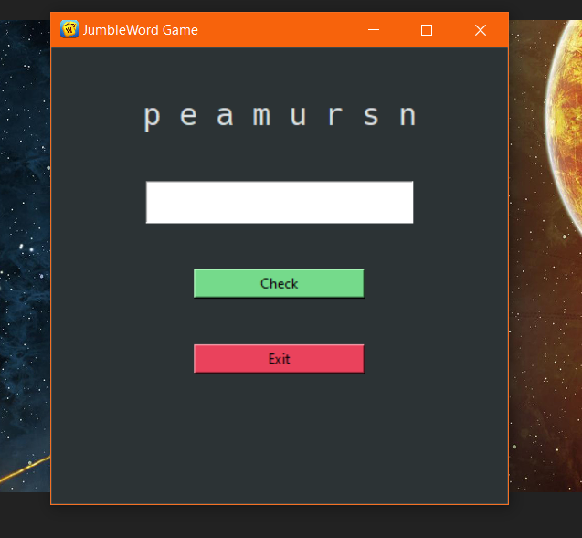
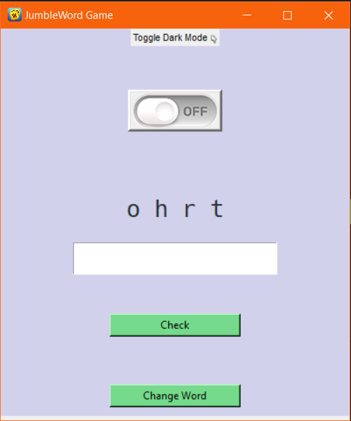

<h1 align="center">Hi 👋, I'm Deepraj Baidya</h1>
<h3 align="center">A passionate Student DEV..😎😎</h3>

 

  

# About This Project:
 

## **JUMBLE WORD GAME**...
 

The library management system in python which we are going to build will look something like this....
Here is a OLD VS NEW Layout after the recent Update.

 

 

Yes, this is the jumble word game I've build. Isn't it **AWESOME**

 

### <ins>**Project Prerequisits**</ins>:
 

##### 1. tkinter – Please run below command to install tkinter
        pip install tkinter
##### 2. random – Preinstalled(no need to install)

 

#### Download Project Code:
Download the project code from [Here](https://github.com/deepraj02/JumbleGame)

 

### 👻<ins>**Description of Project Files.**</ins>
Below are the project files you will get once you download and extract the JumbleGame project:

    - main.py – Contains the Game  

    - wordGenerator.py – To generate the words for the game

 

## About Me😁😎:

- 🔭 I’m currently working on Self Development.

- 🌱 I’m currently learning **Frameworks, Languages, Ethical Hacking Machine Learning and Android Development**

- 🤝 I’m looking for help with [PassWord-Gen_GUI](https://github.com/deepraj02/PassWord_Generator-GUI-)

- 👨‍💻 All of my projects are available at [https://sites.google.com/view/deeprajbaidya/home](https://sites.google.com/view/deeprajbaidya/home)

- 💬 Ask me about **Python, Web Development,C++**

- 📫 How to reach me **deeprajbaidya@06gmail.com**

- ⚡ Fun fact **I Love Coding & Playing ⚽ Football**

- 🌐 Visit My **WEBSITE** [Here](https://deepraj02.github.io)

## Social Links:

  

# **HAPPY CODING..💻**
